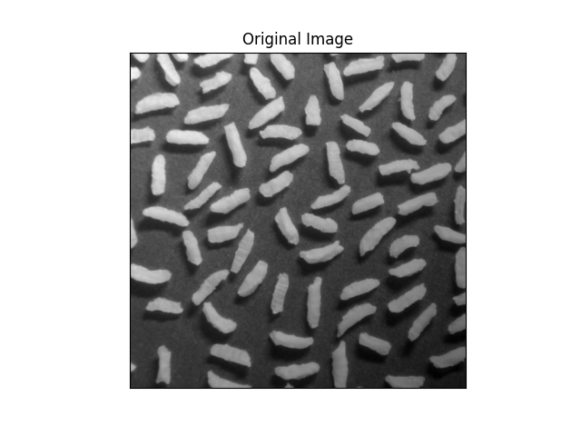
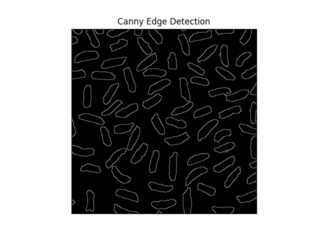
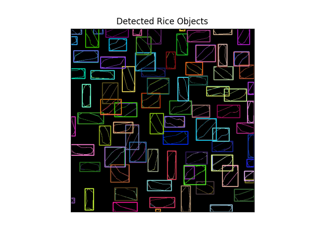
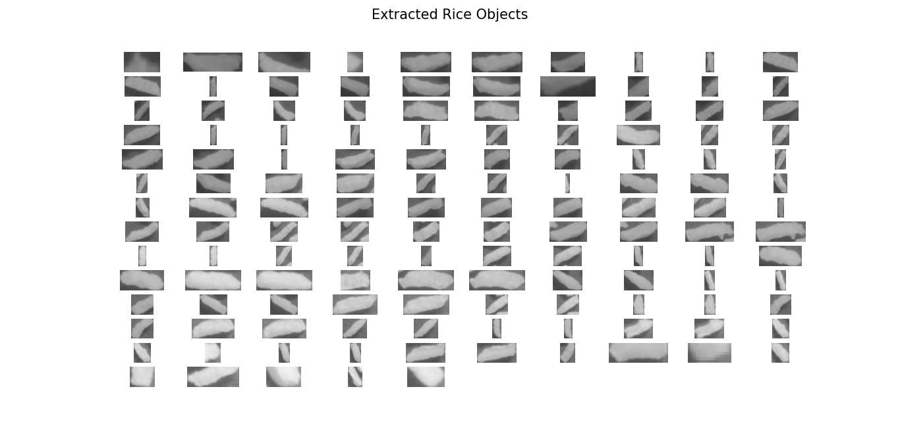

# Extraction of objects from provided image using OpenCV

Code snippet to extract rice from provided image with the help of **OpenCV** and **Matplotlib** library in python 3.


![](https://img.shields.io/badge/Matplotlib-v5.4-%236610f2?style=for-the-badge&logo=data:image/png;base64,iVBORw0KGgoAAAANSUhEUgAAABAAAAAQCAMAAAAoLQ9TAAAB2lBMVEUAAAD///////////////////+xs7Pl6OiHh4eOjo7s7Oz09PScnJympqatra27u7vOzs7BwcHCwsLHx8fn5+e6urvIyMicnJyxsbHX2NnAwMDJycnCwsKxs7O6urq7u7vJycmsrKxIZatUa6Vue2BxbGd0va55i3Z5jsWXcU6Y2pacrpagoKCoqKiq2Kivr6+wdU6wttGxu7Gzvb2z1rK0uaC4sLO5ubm72Lu8t7W8uLe8yLy9vMC9wMHA0YvBwcHCrqXCz7HDw8PEq6DEyczEzaLF3U7Iz9HI2MvI41vLx8XLycjLy8vMuHvMy9DMzMzOs0HO0cnP1dfQgUTQkGvRs6fSjmLSvG/S1dbTwbnT09PUfgDU0MfU0tHV1dXV19jV4NTWuQDWycTW1tbY2N7Z2dnZ2drc3Nzc3d3c3uDdyKbd3d3ekVje3t7e4OXfikTfy4Xf4OHg4eDg4ePhwEHh4ODh4eHjxD/j4+Pk5OTp6+7qkUrq7PLr6+3r7fPs7Ozt7e3u7e7u7u7v7+/v8/byk0Hz8/b08/H1jyb19fX41Ef4+Pj4+Pn5+fn61kP7kh77+Pv7+/v7+/z8/Pz9/f39/v79///+/v7/oFb/o1n/pmX/3mD/3mb///+K1by6AAAAInRSTlMAAChERmKjpaapq62vtL2+vr+/v8fP0N/f4urs7e/w9PT9ASJnrgAAAPZJREFUeNocjgNTBHAcBX+nbNu2zclNtm27iadsXG6/a/9u9N7uaEVEo9E4BkenhTqrI3Z2qJ0axALtrsoo9lhY+ep+NwGvQcpoXO4G+r6PumY7617mbr2UaIGG9c/Ri4qmtg+m9eLEyOZh+XnvTH3ZHuAuYXTctC4W9FTnc22FEMk83f/9edhIjsuOZfXZVinpa5M7/UupifFJMZdDJmuhRLB9fJaQO9GYNf5mhEhxA3a3yCs6GS4GvEU7BsvLTykZlFzVcKATjSezNsylOWaqHpsDVJgm8P6/2gz8zVsW4hmRdKAA0HMVojDvsggrOJkrCLGC+AA9MlD6ac5sNAAAAABJRU5ErkJggg==)


## Table of contents
* [Introduction](#introduction)
* [Technologies](#technologies)
* [Setup](#setup)
* [Launch](#launch)
* [Working](#working)
* [Illustrations](#illustrations)
* [Status](#status)
* [Sources](#sources)
* [Other](#other)


## Introduction
We are provided with image of grains
of rice. We need to seperate each rice grain from image. 

## Technologies
  #### Software Used :
  * VS Code 1.60.1
  #### Languages Used :
  * Python 3
  #### OS used :
   * Ubuntu 20.04.3 LTS 64-bit


## Setup
First you must have these libraries and languages installed on your system -
  * [Python 3](https://www.python.org/)
  * [OpenCV](https://opencv.org/)
  * [Matplotlib](https://matplotlib.org/)


## Launch
To run the code, run this commands in terminal with main.py as in current directory and images in Images folder along with main.py
```
$ python3 main.py
```
Window will pop-up with resultant images and their histograms.


## Working
* This image was obtained under non-uniform lighting, as evidenced by the
darker area in the bottom, rightmost part of the image. 
* For object segmentation we will first get threshold of this image.
* We then use **Canny Edge Detection** to seperate different blobs.
* **cv2.findContours()** is helpful in retrieving contours from the binary image. The contours are a useful tool for shape analysis and object detection.
* We then draw rectangle around detected contours and crop them from original image.

## Illustrations

<p>
  
  
</p>
<p>
  
  
</p>

## Status
  ***Completed***


## Sources
  * Images used in this project may be subject to copyright.
  * [Digital Image Processing (Third Edition) by Rafael C. Gonzalez and Richard E. Woods](https://www.amazon.com/Digital-Image-Processing-Rafael-Gonzalez/dp/013168728X)
  * [OpenCV Documentation](https://docs.opencv.org/2.4/opencv_tutorials.pdf)
  * [Matplotlib Documentation](https://matplotlib.org/stable/contents.html)
  

## Other
  This code is contributed by Abhinav Sharma.

